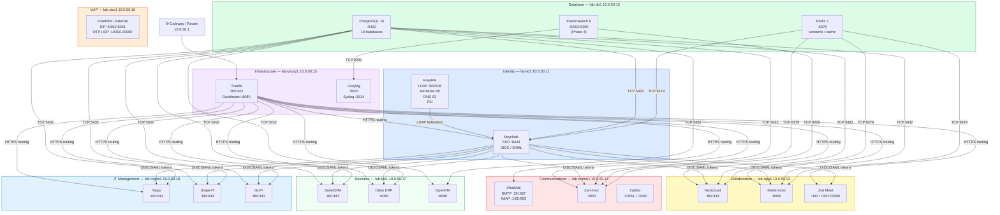

# IT-Stack Network Topology

> This document describes the production network layout for IT-Stack.  
> For the architecture decision behind this layout see [ADR-006](adr-006-8server-layout.md).

---

## Network Summary

| Property | Value |
|----------|-------|
| Subnet | `10.0.50.0/24` |
| Gateway | `10.0.50.1` |
| DNS Server | `10.0.50.11` (FreeIPA on lab-id1) |
| Domain | `it-stack.lab` |
| Reverse zone | `50.0.10.in-addr.arpa` |
| Inbound TLS | `10.0.50.15` (Traefik on lab-proxy1) |
| OS | Ubuntu 24.04 LTS (all nodes) |

---

## Server Layout

```
10.0.50.0/24  — IT-Stack LAN
│
├── 10.0.50.1   [Gateway / Router]
│
├── 10.0.50.11  lab-id1        Identity
│               ├── FreeIPA    (LDAP :389/:636, Kerberos :88, DNS :53)
│               └── Keycloak   (HTTPS :8443)
│
├── 10.0.50.12  lab-db1        Database
│               ├── PostgreSQL (TCP :5432)
│               └── Redis      (TCP :6379)
│
├── 10.0.50.13  lab-app1       Collaboration
│               ├── Nextcloud  (HTTP :80/:443)
│               ├── Mattermost (HTTP :8065)
│               └── Jitsi Meet (HTTPS :443, UDP :10000)
│
├── 10.0.50.14  lab-comm1      Communications
│               ├── iRedMail   (SMTP :25/:587, IMAP :143/:993)
│               ├── Zammad     (HTTP :3000)
│               └── Zabbix     (Server :10051, Web :3000)
│
├── 10.0.50.15  lab-proxy1     Infrastructure
│               ├── Traefik    (HTTP :80, HTTPS :443, Dashboard :8080)
│               └── Graylog    (Web :9000, Syslog :1514, GELF/UDP :12201)
│
├── 10.0.50.16  lab-pbx1       VoIP
│               └── FreePBX    (SIP :5060/:5061, RTP UDP :10000-20000)
│
├── 10.0.50.17  lab-biz1       Business
│               ├── SuiteCRM   (HTTP :80/:443)
│               ├── Odoo       (HTTP :8069, LiveChat :8072)
│               └── OpenKM     (HTTP :8080)
│
└── 10.0.50.18  lab-mgmt1      IT Management
                ├── Taiga      (HTTP :80/:443)
                ├── Snipe-IT   (HTTP :80/:443)
                └── GLPI       (HTTP :80/:443)
```

---

## Topology Diagram



---

## DNS Records

FreeIPA (`lab-id1`) is the authoritative DNS server for the `it-stack.lab` zone.

### A Records

| Hostname | IP |
|----------|----|
| `lab-id1.it-stack.lab` | 10.0.50.11 |
| `lab-db1.it-stack.lab` | 10.0.50.12 |
| `lab-app1.it-stack.lab` | 10.0.50.13 |
| `lab-comm1.it-stack.lab` | 10.0.50.14 |
| `lab-proxy1.it-stack.lab` | 10.0.50.15 |
| `lab-pbx1.it-stack.lab` | 10.0.50.16 |
| `lab-biz1.it-stack.lab` | 10.0.50.17 |
| `lab-mgmt1.it-stack.lab` | 10.0.50.18 |

### CNAME Records (service subdomains → lab-proxy1)

| CNAME | Points To | Service |
|-------|-----------|---------|
| `sso.it-stack.lab` | `lab-id1.it-stack.lab` | Keycloak (direct; no proxy) |
| `ipa.it-stack.lab` | `lab-id1.it-stack.lab` | FreeIPA (direct; no proxy) |
| `cloud.it-stack.lab` | `lab-proxy1.it-stack.lab` | Nextcloud |
| `chat.it-stack.lab` | `lab-proxy1.it-stack.lab` | Mattermost |
| `meet.it-stack.lab` | `lab-proxy1.it-stack.lab` | Jitsi |
| `mail.it-stack.lab` | `lab-proxy1.it-stack.lab` | iRedMail webmail |
| `desk.it-stack.lab` | `lab-proxy1.it-stack.lab` | Zammad |
| `monitor.it-stack.lab` | `lab-proxy1.it-stack.lab` | Zabbix |
| `crm.it-stack.lab` | `lab-proxy1.it-stack.lab` | SuiteCRM |
| `erp.it-stack.lab` | `lab-proxy1.it-stack.lab` | Odoo |
| `dms.it-stack.lab` | `lab-proxy1.it-stack.lab` | OpenKM |
| `pm.it-stack.lab` | `lab-proxy1.it-stack.lab` | Taiga |
| `assets.it-stack.lab` | `lab-proxy1.it-stack.lab` | Snipe-IT |
| `itsm.it-stack.lab` | `lab-proxy1.it-stack.lab` | GLPI |
| `logs.it-stack.lab` | `lab-proxy1.it-stack.lab` | Graylog |
| `proxy.it-stack.lab` | `lab-proxy1.it-stack.lab` | Traefik dashboard |

---

## Firewall Rules Summary

### lab-id1 (Identity)

| Port | Protocol | From | Service |
|------|----------|------|---------|
| 53 | TCP/UDP | All LAN | DNS |
| 88 | TCP/UDP | All LAN | Kerberos |
| 389 | TCP | All LAN | LDAP |
| 443 | TCP | All LAN | FreeIPA HTTPS |
| 636 | TCP | All LAN | LDAPS |
| 8443 | TCP | All LAN | Keycloak |

### lab-db1 (Database)

| Port | Protocol | From | Service |
|------|----------|------|---------|
| 5432 | TCP | Application servers only | PostgreSQL |
| 6379 | TCP | Application servers only | Redis |
| 9200 | TCP | lab-proxy1, lab-comm1 | Elasticsearch |

### lab-proxy1 (Ingress)

| Port | Protocol | From | Service |
|------|----------|------|---------|
| 80 | TCP | All | HTTP (redirect to 443) |
| 443 | TCP | All | HTTPS (Traefik) |
| 9000 | TCP | LAN only | Graylog UI |
| 12201 | UDP | All LAN | GELF log input |
| 1514 | TCP/UDP | All LAN | Syslog input |

### lab-pbx1 (VoIP)

| Port | Protocol | From | Service |
|------|----------|------|---------|
| 5060 | UDP/TCP | All (SIP clients) | SIP |
| 5061 | TCP | All (SIP TLS) | SIP TLS |
| 10000–20000 | UDP | All (RTP clients) | RTP audio/video |

---

## Lab / Home Tier Topology (Tier 1A)

For 1–3 machine deployments, services are consolidated:

```
10.0.10.0/24 (example home lab subnet)

10.0.10.10  vm-01   FreeIPA + Keycloak + PostgreSQL + Redis + Traefik
10.0.10.11  vm-02   Nextcloud + Mattermost + Jitsi
10.0.10.12  vm-03   iRedMail + Zammad
```

See [ADR-006](adr-006-8server-layout.md) for tier descriptions and [Lab Deployment Plan](../02-implementation/03-lab-deployment-plan.md) for lab-specific configuration.
