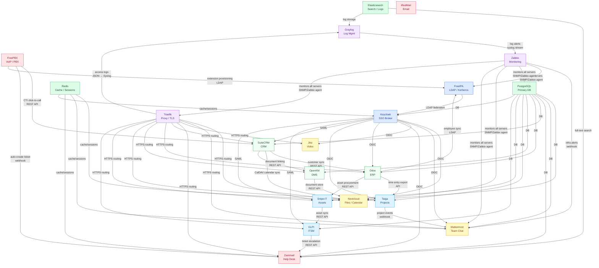

# IT-Stack Service Integration Map

> This document maps all cross-service integrations in IT-Stack.  
> For implementation procedures see [Integration Guide](../02-implementation/12-integration-guide.md).

---

## Integration Overview

IT-Stack's 20 services form a connected ecosystem. Every service depends on the identity layer (FreeIPA + Keycloak) and most depend on the database tier (PostgreSQL + Redis). Beyond those foundations, there are 22 documented cross-service integrations.

| Integration Type | Count | Examples |
|-----------------|-------|---------|
| Identity (SSO) | 9 | All web apps → Keycloak OIDC/SAML |
| Database | 10 | All stateful apps → PostgreSQL |
| Business data sync | 6 | Odoo ↔ SuiteCRM, Snipe-IT ↔ GLPI |
| Notifications/webhooks | 4 | Zabbix → Mattermost, Taiga → Mattermost |
| Communication integration | 3 | FreePBX ↔ SuiteCRM, FreePBX ↔ Zammad |
| Observability | 2 | Graylog ↔ Zabbix |

---

## Integration Diagram



---

## Integration Details

### Layer 1: Identity (FreeIPA + Keycloak)

All web services authenticate via Keycloak, which federates from FreeIPA LDAP.

| Integration | Protocol | Direction | Notes |
|-------------|----------|-----------|-------|
| FreeIPA → Keycloak | LDAP (read-only federation) | FreeIPA is source of truth | Group sync every 5 min |
| Keycloak → Nextcloud | OIDC | Keycloak is IdP | `nextcloud` client; groups mapped to admin/users |
| Keycloak → Mattermost | OIDC | Keycloak is IdP | `mattermost` client; SSO + group sync |
| Keycloak → Jitsi | OIDC / JWT | Keycloak is IdP | JWT tokens for room auth |
| Keycloak → Zammad | OIDC | Keycloak is IdP | `zammad` client; maps roles to agent/customer |
| Keycloak → Odoo | OIDC | Keycloak is IdP | `odoo` client; employee groups |
| Keycloak → Taiga | OIDC | Keycloak is IdP | `taiga` client; maps to project roles |
| Keycloak → SuiteCRM | SAML 2.0 | Keycloak is IdP | `suitecrm` client; SAML assertion with role attribute |
| Keycloak → GLPI | SAML 2.0 | Keycloak is IdP | `glpi` client; tech/admin roles |
| Keycloak → Snipe-IT | SAML 2.0 | Keycloak is IdP | `snipeit` client; admin/user roles |
| FreePBX → FreeIPA | LDAP | FreeIPA is directory | Extension-to-user mapping; voicemail auth |
| Odoo → FreeIPA | LDAP | FreeIPA is directory | Employee directory sync; `uid` attribute |

### Layer 2: Database (PostgreSQL + Redis + Elasticsearch)

| Service | Database | Schema Owner | Session/Cache |
|---------|----------|-------------|--------------|
| Keycloak | `keycloak` | `keycloak_user` | Redis (session tokens) |
| Nextcloud | `nextcloud` | `nextcloud_user` | Redis (file lock cache) |
| Mattermost | `mattermost` | `mattermost_user` | Redis (job queue) |
| Zammad | `zammad` | `zammad_user` | Redis + ES (full-text search) |
| SuiteCRM | `suitecrm` | `suitecrm_user` | — |
| Odoo | `odoo` | `odoo_user` | — |
| OpenKM | `openkm` | `openkm_user` | — |
| Taiga | `taiga` | `taiga_user` | Redis (async tasks) |
| Snipe-IT | `snipeit` | `snipeit_user` | — |
| GLPI | `glpi` | `glpi_user` | — |

### Layer 3: Business Integrations

| Integration | Method | Data Synced | Trigger |
|-------------|--------|------------|---------|
| FreePBX → SuiteCRM | CTI / REST API | Call logs, caller ID → contact lookup | Incoming call |
| FreePBX → Zammad | Webhook (AMI event) | Auto-create ticket on missed/incoming call | Call end event |
| CRM → Odoo | REST API (bidirectional) | Customer = Contact in Odoo; invoice updates CRM | Scheduled + on save |
| CRM → Nextcloud | CalDAV | Contact meetings → Nextcloud calendar | On meeting create |
| CRM → OpenKM | REST API | Quote/contract PDFs linked to CRM records | On document attach |
| Odoo → Taiga | REST API | Billable hours from Taiga timesheets → Odoo invoicing | Daily batch |
| Odoo → Snipe-IT | REST API | Purchase orders create assets in Snipe-IT | On PO approval |
| Snipe-IT → GLPI | REST API | Asset checkout/checkin syncs CMDB | On asset change |
| GLPI → Zammad | REST API | Major incident in GLPI escalates to Zammad ticket | On GLPI alert |
| OpenKM → Nextcloud | REST API / WebDAV | Approved documents published to Nextcloud | On document approve |

### Layer 4: Notifications and Observability

| Integration | Method | Channel | Notes |
|-------------|--------|---------|-------|
| Taiga → Mattermost | Webhook | `#dev-notifications` | Issue created, sprint started, deployment |
| Zabbix → Mattermost | Webhook (Zabbix media type) | `#ops-alerts` | Problem, recovery, ack events |
| Graylog → Zabbix | Syslog stream | Zabbix log item | Graylog alerts trigger Zabbix problem |
| Traefik → Graylog | Access log (JSON → GELF/Syslog) | Graylog stream "web-access" | All HTTP/HTTPS requests |

---

## Dependency Graph (Startup Order)

Services must be started in dependency order. This is enforced by Ansible tags and the `deploy-stack.sh` script.

```
Phase 0 (networking):  FreeIPA DNS must resolve before anything else
Phase 1a:  PostgreSQL, Redis
Phase 1b:  Keycloak (needs PostgreSQL + FreeIPA)
Phase 1c:  Traefik (needs DNS but not application services)
Phase 2a:  Nextcloud, Mattermost, Jitsi (need PG + Redis + Keycloak)
Phase 2b:  iRedMail (independent; needs DNS only)
Phase 2c:  Zammad (needs PG + ES + Keycloak)
Phase 3a:  Elasticsearch (Phase 4 only; Zammad can use PG FTS in Phase 2)
Phase 3b:  FreePBX (needs FreeIPA LDAP; independent of web services)
Phase 3c:  SuiteCRM, Odoo, OpenKM (need PG + Keycloak)
Phase 4a:  Taiga, Snipe-IT, GLPI (need PG + Keycloak)
Phase 4b:  Zabbix (needs all services running to monitor them)
Phase 4c:  Graylog (needs ES; collects logs from Traefik and all other services)
```

---

## References

- [ADR-001: Identity Stack](adr-001-identity-stack.md)
- [ADR-002: PostgreSQL Primary](adr-002-postgresql-primary.md)
- [ADR-003: Traefik Proxy](adr-003-traefik-proxy.md)
- [ADR-006: 8-Server Layout](adr-006-8server-layout.md)
- [Implementation: Integration Guide](../02-implementation/12-integration-guide.md)
- [Network Topology](network-topology.md)
